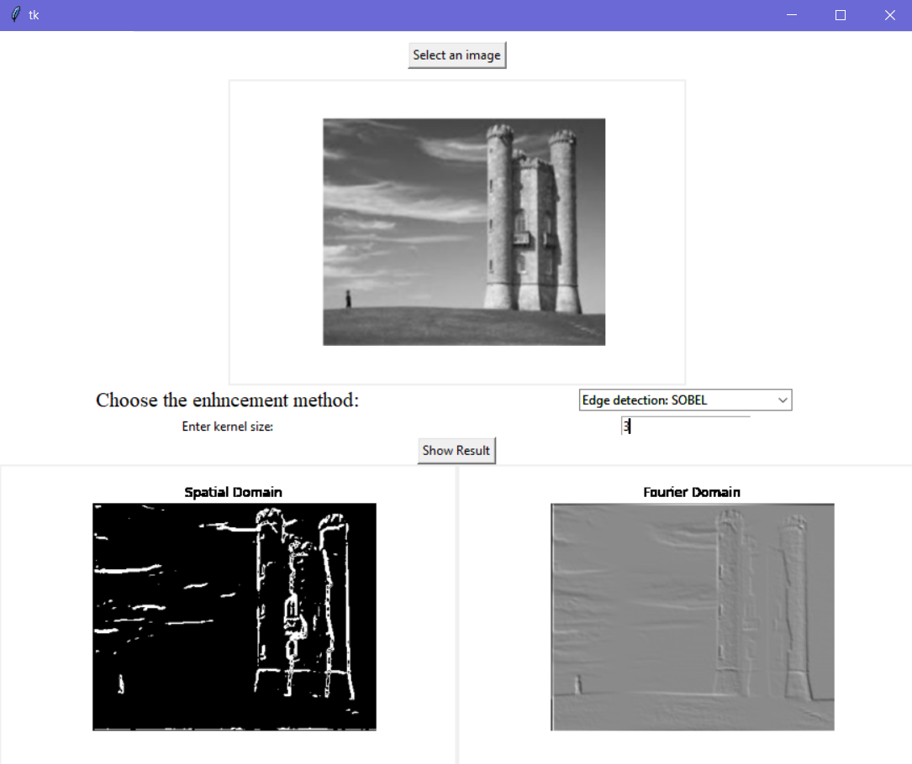
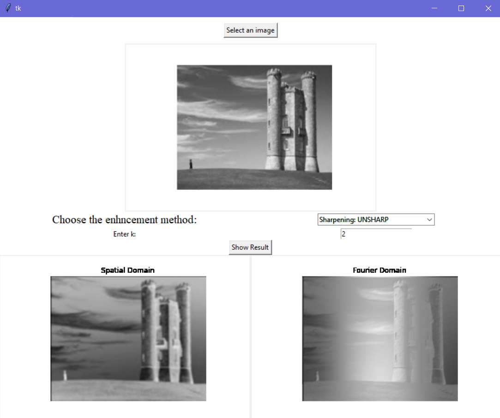

# Python GUI for Spatial Frequency Enhancement Methods
This is a friendly Graphical User Interface (GUI) that allows the user to apply some of spatial &amp; frequency enhancement methods.

The allowed enhancement methods are:
* Average Smoothing
* Gaussian Smoothing
* Laplacian Sharpening
* Unsharp
* Sobel Edge Detection
* Laplacian Edge Detection

## Features
* GUI using Tkinter
* Upload an image
* User is able to save the output
* User can modify the parameters for the enhancement method

## Screenshots

